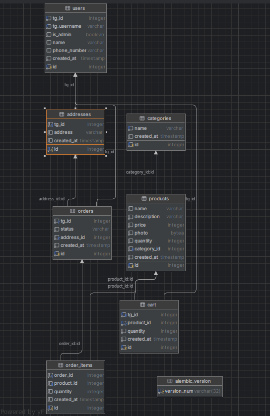

# E-COMMERCE-BOT

Этот Telegram бот — онлайн-магазин, позволяющий пользователям просматривать товары, добавлять их в корзину, оформлять
заказы и управлять адресами доставки. Бот интегрирован с базой данных PostgreSQL для хранения данных о пользователях,
товарах, категориях, заказах и адресах.

### Установка

1. **Клонируйте репозиторий:**

   ```bash
   git clone <ссылка на ваш репозиторий>
   cd <имя папки репозитория>
   ```

2. **Создайте файл `.env` в корне проекта:**

   ```.dotenv
   TELEGRAM_BOT_TOKEN=
   
   
   POSTGRES_USER=postgres
   POSTGRES_PASSWORD=postgres
   POSTGRES_HOST=tg_postgres
   POSTGRES_PORT=5432
   POSTGRES_DB=telegram_bot_db
   ```

3. **Запустите сервис:**
   ```bash
   make up
   ```

### Команды бота

- **/start:** Запуск бота, приветственное сообщение и переход в главное меню.
- **/admin:** Доступ к админ-функциям (только для пользователей с правами администратора).


### Схема БД
